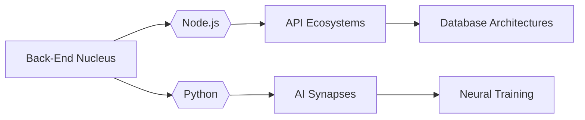

<div align="center">
   
</div>

##  **Code Samurai of the Neon Wasteland** 

```xml
<cyber-profile>
  <corporate-affiliation>Persol Cross Technology</corporate-affiliation>
  <neural-languages>JavaScript | Python | Math</neural-languages>
  <cyberware>MERN Stack Implants</cyberware>
</cyber-profile>
```

###  **Language DNA Sequence** (Real-Time Sync)
```python
# Auto-generated from all repositories
def update_languages():
    return scrape_github_api()  # Runs daily via GitHub Actions
```
[](https://github.com/HelloWounderworld)

---

###  **Neural Network Pathways**


---

###  **System Interface**
<div align="center">

| Protocol Stack     | Version       | Status    |
|--------------------|---------------|-----------|
| **Neuro-Learning** | JavaScript ES |  |
| **AI Cores**       | Python 3.11   |  |
| **Visual Cortex**  | React 18      |  |

</div>

---

<div align="center">
  
</div>

> **System Note:** *"In this neon-lit data jungle, every algorithm tells a story of π and loss functions... until we meet at the convergence point of anime and machine code."* -  [Connect Neural Node](www.linkedin.com/in/leonardo-t-691810220)